# TerraLink Data Model

> Generated from migrations `20260309000001` – `20260309000009`.
> Source of truth: `supabase/migrations/`

---

## Extensions

| Extension | Schema | Purpose |
|---|---|---|
| PostGIS | extensions | Spatial data (geography/geometry) |
| pgvector | extensions | Future RAG / similarity search |
| pgmq | public | Job queues (ingestion, screening, risk, notification) |
| moddatetime | extensions | Auto updated_at triggers |

---

## ERD Overview (Mermaid)

```mermaid
erDiagram
    %% ── Auth / Tenancy ─────────────────────────────
    auth_users ||--|| profiles : "1:1"
    profiles {
        uuid id PK
        text full_name
        text avatar_url
    }

    workspaces ||--o{ workspace_members : "has"
    workspaces {
        uuid id PK
        text name
        text slug UK
        text plan_code
        uuid primary_buyer_org_id FK
        jsonb settings
        timestamptz deleted_at
    }

    workspace_members {
        uuid id PK
        uuid workspace_id FK
        uuid user_id FK
        text role
        text status
    }

    organizations ||--o{ organization_members : "has"
    organizations ||--o{ organization_sites : "has"
    organizations {
        uuid id PK
        text legal_name
        text display_name
        text org_type
        text country_code
        jsonb external_refs
        timestamptz deleted_at
    }

    organization_members {
        uuid id PK
        uuid organization_id FK
        uuid user_id FK
        text role
        boolean share_default
    }

    workspaces ||--o{ workspace_organizations : "links"
    organizations ||--o{ workspace_organizations : "linked by"
    workspace_organizations {
        uuid id PK
        uuid workspace_id FK
        uuid organization_id FK
        text relationship_role
        integer tier
        text status
        text verification_status
    }

    %% ── Supply Graph ───────────────────────────────
    sites ||--o{ organization_sites : "owned by"
    sites ||--o{ workspace_sites : "scoped to"
    sites {
        uuid id PK
        text site_name
        text site_type
        text country_code
        float latitude
        float longitude
        geography geom
        text verification_status
        timestamptz deleted_at
    }

    workspace_sites {
        uuid id PK
        uuid workspace_id FK
        uuid site_id FK
        uuid workspace_organization_id FK
        text scope_role
        integer tier
        numeric criticality
        text verification_status
    }

    materials {
        uuid id PK
        text name
        text category
        text hs_code
    }

    processes {
        uuid id PK
        text process_code UK
        text name
        text process_group
    }

    workspace_organizations ||--o{ supply_relationships : "from/to"
    supply_relationships ||--o{ supply_edges : "has edges"
    supply_relationships {
        uuid id PK
        uuid workspace_id FK
        uuid from_workspace_org_id FK
        uuid to_workspace_org_id FK
        text relationship_type
        text verification_status
        numeric confidence_score
        timestamptz deleted_at
    }

    supply_edges ||--o{ supply_edge_materials : "carries"
    supply_edges {
        uuid id PK
        uuid workspace_id FK
        uuid relationship_id FK
        uuid from_site_id FK
        uuid to_site_id FK
        uuid process_id FK
        text flow_direction
        text verification_status
        timestamptz deleted_at
    }

    supply_edge_materials {
        uuid id PK
        uuid supply_edge_id FK
        uuid material_id FK
        numeric share_ratio
        boolean is_critical
    }

    %% ── External Sources ───────────────────────────
    data_sources ||--o{ source_versions : "versioned"
    data_sources ||--o{ ingestion_runs : "triggers"
    data_sources {
        uuid id PK
        text source_key UK
        text source_name
        text category
        text access_mode
        boolean is_active
    }

    source_versions ||--o{ source_observations : "contains"
    source_versions {
        uuid id PK
        uuid data_source_id FK
        text version_label
        text checksum
    }

    ingestion_runs {
        uuid id PK
        uuid data_source_id FK
        uuid source_version_id FK
        text status
        jsonb stats
    }

    source_observations {
        uuid id PK
        uuid source_version_id FK
        text entity_type
        jsonb raw_payload
        jsonb normalized_payload
    }

    workspace_sites ||--o{ spatial_intersections : "intersects"
    spatial_intersections {
        uuid id PK
        uuid workspace_site_id FK
        uuid data_source_id FK
        uuid source_version_id FK
        text intersection_type
        numeric distance_m
        numeric severity_hint
    }

    %% ── Assessments / LEAP ─────────────────────────
    workspaces ||--o{ assessments : "owns"
    assessments ||--o{ assessment_scopes : "scopes"
    assessments {
        uuid id PK
        uuid workspace_id FK
        text assessment_cycle
        text method_version
        text status
    }

    assessment_scopes ||--o{ dependencies : "evaluated"
    assessment_scopes ||--o{ impacts : "evaluated"
    assessment_scopes ||--o{ risk_register : "assessed"
    assessment_scopes {
        uuid id PK
        uuid assessment_id FK
        text scope_type
        text coverage_status
    }

    nature_topics {
        uuid id PK
        text topic_key UK
        text name
        text topic_group
    }

    dependencies {
        uuid id PK
        uuid assessment_scope_id FK
        uuid nature_topic_id FK
        text dependency_level
        text source_type
    }

    impacts {
        uuid id PK
        uuid assessment_scope_id FK
        uuid nature_topic_id FK
        text impact_direction
        text impact_level
        text source_type
    }

    risk_register ||--o{ risk_scores : "scored"
    risk_register {
        uuid id PK
        uuid assessment_scope_id FK
        text risk_type
        text title
        text status
    }

    risk_scores {
        uuid id PK
        uuid risk_id FK
        numeric severity
        numeric likelihood
        numeric final_score
    }

    workspaces ||--o{ monitoring_rules : "watches"
    monitoring_rules ||--o{ monitoring_events : "fires"
    monitoring_rules {
        uuid id PK
        uuid workspace_id FK
        text target_type
        uuid target_id
        text rule_type
        boolean is_active
    }

    monitoring_events {
        uuid id PK
        uuid monitoring_rule_id FK
        text status
        text severity
        text title
    }

    %% ── Evidence / Audit ───────────────────────────
    evidence_items ||--o{ evidence_links : "linked to"
    evidence_items {
        uuid id PK
        uuid workspace_id FK
        uuid organization_id FK
        uuid site_id FK
        text file_name
        text evidence_type
        text visibility
        timestamptz deleted_at
    }

    evidence_links {
        uuid id PK
        uuid evidence_item_id FK
        text target_type
        uuid target_id
    }

    change_log {
        uuid id PK
        uuid workspace_id FK
        uuid actor_user_id FK
        text target_table
        uuid target_id
        text action
        jsonb before_state
        jsonb after_state
    }

    assessments ||--o{ disclosures : "produces"
    disclosures {
        uuid id PK
        uuid workspace_id FK
        uuid assessment_id FK
        text framework
        text section_key
        text status
    }
```

---

## Table Summary (31 tables)

### Auth / Tenancy (6 tables)
| Table | Soft Delete | RLS Strategy |
|---|---|---|
| `profiles` | No | Own row only |
| `workspaces` | Yes | Member-based |
| `workspace_members` | No | Workspace scoped |
| `organizations` | Yes | Via workspace linkage + org membership |
| `organization_members` | No | Org membership + workspace linkage |
| `workspace_organizations` | No | Workspace scoped |

### Supply Graph (8 tables)
| Table | Soft Delete | RLS Strategy |
|---|---|---|
| `sites` | Yes | Via workspace_sites / organization_sites linkage |
| `organization_sites` | No | Via org membership / workspace linkage |
| `workspace_sites` | No | Workspace scoped |
| `materials` | No | Authenticated read-only (reference data) |
| `processes` | No | Authenticated read-only (reference data) |
| `supply_relationships` | Yes | Workspace scoped |
| `supply_edges` | Yes | Workspace scoped |
| `supply_edge_materials` | No | Via supply_edges → workspace |

### External Sources (5 tables)
| Table | Soft Delete | RLS Strategy |
|---|---|---|
| `data_sources` | No | Authenticated read-only; writes via service_role |
| `source_versions` | No | Authenticated read-only; writes via service_role |
| `ingestion_runs` | No | Authenticated read-only; writes via service_role |
| `source_observations` | No | Authenticated read-only; writes via service_role |
| `spatial_intersections` | No | Via workspace_sites → workspace |

### Assessments / LEAP (8 tables)
| Table | Soft Delete | RLS Strategy |
|---|---|---|
| `assessments` | No | Workspace scoped |
| `assessment_scopes` | No | Via assessments → workspace |
| `nature_topics` | No | Authenticated read-only (reference data) |
| `dependencies` | No | Via assessment_scopes → assessments → workspace |
| `impacts` | No | Via assessment_scopes → assessments → workspace |
| `risk_register` | No | Via assessment_scopes → assessments → workspace |
| `risk_scores` | No | Via risk_register → ... → workspace |
| `monitoring_rules` | No | Workspace scoped |
| `monitoring_events` | No | Via monitoring_rules → workspace |

### Evidence / Audit (4 tables)
| Table | Soft Delete | RLS Strategy |
|---|---|---|
| `evidence_items` | Yes | Workspace scoped + visibility control |
| `evidence_links` | No | Via evidence_items → workspace |
| `change_log` | No | Append-only; read via workspace |
| `disclosures` | No | Workspace scoped |

---

## pgmq Queues

| Queue | Purpose |
|---|---|
| `ingestion_jobs` | Ingest external data sources |
| `screening_jobs` | Spatial screening for workspace sites |
| `risk_jobs` | Recompute risk scores |
| `notification_jobs` | Email / reminder dispatch |

---

## Helper Functions

| Function | Purpose |
|---|---|
| `set_updated_at()` | Trigger: auto-set `updated_at` on update |
| `is_workspace_member(ws_id)` | RLS helper: check active workspace membership |
| `has_workspace_role(ws_id, roles[])` | RLS helper: check membership with specific roles |
| `is_org_member(org_id)` | RLS helper: check organization membership |
| `handle_new_user()` | Trigger: create profile on auth.users insert |
| `apply_updated_at_trigger(tbl)` | Convenience: attach updated_at trigger to a table |
| `sites_sync_geom()` | Trigger: sync lat/lng to PostGIS geography column |

---

## Key Design Decisions

1. **Workspace isolation**: All business data is scoped to workspaces via RLS.
2. **Shared vs private**: `organizations` and `sites` are shared entities; access is granted through `workspace_organizations` / `workspace_sites` linkage.
3. **Verification status**: `inferred` / `declared` / `verified` is tracked on supply-chain and site data.
4. **External data separation**: Raw external payloads (`source_observations`) are kept separate from normalized business tables.
5. **Append-only audit**: `change_log` has no UPDATE/DELETE RLS policies.
6. **PostGIS from day one**: `sites.geom` is `geography(point, 4326)` with auto-sync trigger.
7. **Version-tracked intersections**: `spatial_intersections` are linked to specific `source_versions`, never overwritten.
